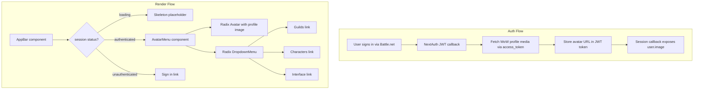

# Design Document: AppBar Avatar Menu

## Overview

This feature replaces the current text-based authenticated user section in the AppBar (`components/layout/app-bar.tsx`) with a circular avatar button and a Radix UI dropdown menu. The avatar displays the user's WoW profile image (sourced during authentication via the Battle.net API). Clicking the avatar opens a dropdown with navigation links to Guilds, Characters, and Interface pages. Unauthenticated users continue to see the existing "Sign in" link.

The implementation touches three layers:
1. **Auth layer** — Extend the NextAuth JWT/session callbacks to fetch and persist the WoW profile image URL during sign-in.
2. **Component layer** — Create an `AvatarMenu` component using `@radix-ui/react-avatar` and `@radix-ui/react-dropdown-menu`, and integrate it into the existing `AppBar`.
3. **AppBar integration** — Swap the current authenticated-user block in `AppBar` for the new `AvatarMenu`, keeping the unauthenticated path unchanged.

## Architecture



The avatar image URL flows from the Battle.net API → JWT token → session → React component. No additional client-side API calls are needed on each render.

## Components and Interfaces

### AvatarMenu Component

**Path:** `components/layout/avatar-menu.tsx`

A client component that renders the avatar trigger and dropdown menu.

```typescript
// Props — none needed; reads session via useSession()
// Internal state managed by Radix DropdownMenu (open/close)

interface MenuItemConfig {
  label: string;
  href: string;
}

const MENU_ITEMS: MenuItemConfig[] = [
  { label: "Guilds", href: "/guilds" },
  { label: "Characters", href: "/characters" },
  { label: "Interface", href: "/interface" },
];
```

**Composition:**
- `DropdownMenu.Root` — manages open/close state
- `DropdownMenu.Trigger` — wraps the `Avatar` component, `asChild` for custom trigger
- `Avatar.Root` / `Avatar.Image` / `Avatar.Fallback` — renders profile image or initials
- `DropdownMenu.Portal` → `DropdownMenu.Content` — the menu panel
- `DropdownMenu.Item` — each navigation link, rendered via `next/link`

**Fallback logic:**
- `Avatar.Fallback` renders the first two characters of the user's battletag (or a generic user icon from `lucide-react` if no battletag is available).

### Updated AppBar

**Path:** `components/layout/app-bar.tsx`

The authenticated block is replaced:

```
Before: <span>{name}</span> + <Link href="/account"> + <Link href="/signout">
After:  <AvatarMenu />
```

The `useSession()` call remains in `AppBar` to gate which block renders (sign-in link vs avatar menu vs skeleton).

### Helper: getInitials

**Path:** `lib/utils.ts` (add to existing utility file)

```typescript
export function getInitials(battletag: string | undefined | null): string
```

Extracts up to 2 uppercase initials from the battletag (portion before `#`). Returns `"?"` if input is falsy or empty.

### Auth Callback Changes

**Path:** `lib/auth/auth.ts`

Extend the `jwt` callback:
- On initial sign-in (`account` is present), use the `account.access_token` to call the Battle.net WoW profile media endpoint (`https://{region}.api.blizzard.com/profile/user/wow?namespace=profile-{region}`) to retrieve the user's avatar URL.
- Store the URL as `token.picture`.
- If the API call fails, set `token.picture = null` and continue.

Extend the `session` callback:
- Map `token.picture` → `session.user.image`.

## Data Models

### Extended JWT Token

```typescript
// Additions to the JWT token (lib/auth/auth.ts)
interface ExtendedJWT extends JWT {
  accessToken?: string;
  battletag?: string;
  picture?: string | null;  // WoW profile avatar URL
}
```

### GamerphileSession (existing, no structural change)

```typescript
export interface GamerphileSession extends Session {
  accessToken?: string;
  user: {
    id: string;
    name?: string;
    email?: string;
    image?: string;       // ← populated from token.picture
    battletag?: string;
  };
}
```

### MenuItemConfig

```typescript
interface MenuItemConfig {
  label: string;   // Display text: "Guilds" | "Characters" | "Interface"
  href: string;    // Route path: "/guilds" | "/characters" | "/interface"
}
```

### WoW Profile Response (relevant subset)

The Battle.net user WoW profile endpoint returns:

```typescript
interface WoWUserProfile {
  wow_accounts: Array<{
    characters: Array<{
      character: { href: string };
      name: string;
      id: number;
      realm: { slug: string };
      playable_class: { id: number };
      playable_race: { id: number };
      level: number;
    }>;
  }>;
}
```

For the avatar, we use the first character's media endpoint to get the avatar render URL. The specific asset key is `"avatar"` from the character media assets array.


## Correctness Properties

*A property is a characteristic or behavior that should hold true across all valid executions of a system — essentially, a formal statement about what the system should do. Properties serve as the bridge between human-readable specifications and machine-verifiable correctness guarantees.*

### Property 1: Auth-state determines rendered UI

*For any* session state (authenticated, unauthenticated, or loading), the AppBar renders the avatar button if and only if the user is authenticated, renders the sign-in link if and only if the user is unauthenticated, and renders a skeleton placeholder if and only if the status is loading. These three states are mutually exclusive in their rendered output.

**Validates: Requirements 1.1, 4.1, 4.2**

### Property 2: Avatar image source matches session

*For any* authenticated session with a non-null `user.image` URL, the rendered avatar `` element's `src` attribute should contain the session's `user.image` value.

**Validates: Requirements 1.2**

### Property 3: Fallback initials derivation

*For any* battletag string, `getInitials(battletag)` should return the first two uppercase characters of the portion before the `#` delimiter. For any null, undefined, or empty input, it should return `"?"`.

**Validates: Requirements 1.3**

### Property 4: Session image round-trip

*For any* valid WoW character media API response containing an `"avatar"` asset, when that response is processed by the JWT callback, the resulting session's `user.image` field should equal the avatar asset's URL value.

**Validates: Requirements 2.1, 2.3**

### Property 5: Menu item href correctness

*For any* menu item in the `MENU_ITEMS` configuration array, the rendered dropdown menu item's link `href` should exactly match the item's configured `href` value.

**Validates: Requirements 3.3**

## Error Handling

| Scenario | Handling |
|---|---|
| WoW profile API fails during sign-in | JWT callback catches the error, sets `token.picture = null`, authentication proceeds normally. User sees fallback avatar. |
| Profile image URL returns 404/broken image | `Avatar.Image` `onLoadingStatusChange` triggers Radix fallback. `Avatar.Fallback` renders battletag initials. |
| No battletag in session | `getInitials` returns `"?"`. A generic user icon from `lucide-react` can be used as an additional fallback. |
| Session expires mid-use | `useSession()` transitions to `unauthenticated` status. AppBar swaps avatar menu for sign-in link. No error state needed. |
| Network timeout on avatar image | Browser handles image load timeout. Radix `Avatar.Fallback` has a `delayMs` prop (default or small value) so the fallback appears quickly if the image doesn't load. |

## Testing Strategy

### Unit Tests

Unit tests cover specific examples, edge cases, and integration points:

- **Skeleton loading state**: Render AppBar with `status="loading"`, verify skeleton element is present and avatar/sign-in are absent.
- **Menu opens on click**: Render AvatarMenu, click trigger, verify three menu items ("Guilds", "Characters", "Interface") appear in order.
- **Menu closes on Escape**: Open menu, press Escape, verify menu content is removed from DOM.
- **ARIA roles**: Verify trigger has `aria-label="User menu"`, menu has `role="menu"`, items have `role="menuitem"`.
- **Focusable trigger**: Verify the avatar button can receive focus via Tab.
- **API failure fallback**: Mock a failing WoW profile fetch in the JWT callback, verify session.user.image is null and auth succeeds.

### Property-Based Tests

Property-based tests use `fast-check` (already in devDependencies) with a minimum of 100 iterations per property. Each test is tagged with its design property reference.

- **Feature: appbar-avatar-menu, Property 1: Auth-state determines rendered UI** — Generate random session states (authenticated with random user data, unauthenticated, loading). Verify mutual exclusivity of rendered elements.
- **Feature: appbar-avatar-menu, Property 2: Avatar image source matches session** — Generate random valid URL strings as `user.image`. Render AvatarMenu, verify the img src contains the generated URL.
- **Feature: appbar-avatar-menu, Property 3: Fallback initials derivation** — Generate random battletag strings (alphanumeric + `#` + digits). Verify `getInitials` output matches expected first-two-chars logic. Also generate null/undefined/empty inputs and verify `"?"` is returned.
- **Feature: appbar-avatar-menu, Property 4: Session image round-trip** — Generate random avatar URL strings, construct mock WoW API responses, run through the JWT callback logic, verify the session output contains the same URL.
- **Feature: appbar-avatar-menu, Property 5: Menu item href correctness** — Generate random `MenuItemConfig` arrays, render the dropdown, verify each rendered link's href matches its config entry.

Each correctness property is implemented by a single property-based test. Tests reference their design property via comment tags in the format: `// Feature: appbar-avatar-menu, Property N: <title>`.
