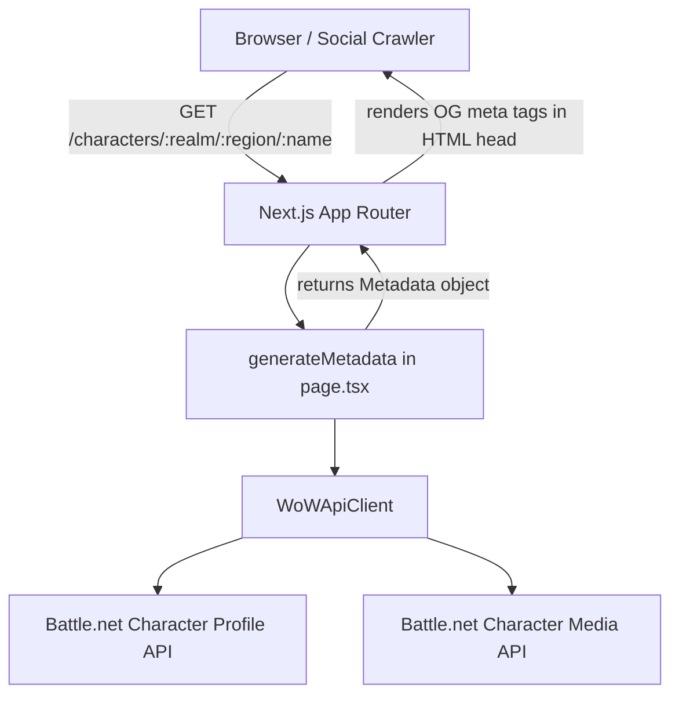
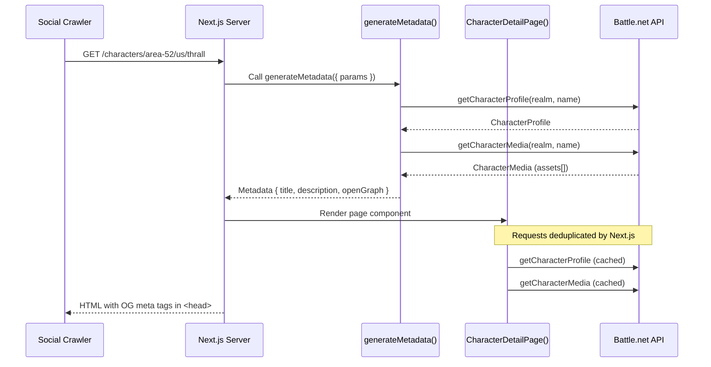

# Design Document: Character OG Image

## Overview

When a user shares a link to a character page (e.g. `/characters/area-52/us/Thrall`), social platforms currently show a generic preview because no Open Graph meta tags are present. This feature adds a `generateMetadata` export to the character detail page so that link previews include the character's hero image (the "main-raw" asset from the WoW Character Media API), along with a descriptive title and description.

The app uses Next.js 15 App Router with server components. The root layout (`app/layout.tsx`) defines static `metadata` with a site-wide title and description, but no page currently exports `generateMetadata`. The character detail page at `app/characters/[realm]/[region]/[characterName]/page.tsx` already fetches character profile and media data via `WoWApiClient`, extracting the `main-raw` asset URL for the hero section. This feature reuses that same data-fetching pattern to populate Open Graph tags.

## Architecture



The `generateMetadata` function runs server-side before the page component renders. Next.js automatically deduplicates fetch requests, so when both `generateMetadata` and the page component call the same API endpoints, the requests are shared — no duplicate API calls occur.



## Components and Interfaces

### Component 1: `generateMetadata` (new export in page.tsx)

**Purpose**: Produces Open Graph metadata for the character page, including the hero image URL, title, and description.

**Interface**:
```typescript
// Next.js App Router metadata API
import type { Metadata } from "next";

export async function generateMetadata({ params }: Props): Promise<Metadata>
```

**Responsibilities**:
- Validate route params (realm, region, characterName) using the same rules as the page component
- Create a region-specific `WoWApiClient` instance
- Fetch character profile and character media from the Battle.net API
- Extract the `main-raw` asset URL from the media response
- Return a `Metadata` object with `title`, `description`, and `openGraph` fields
- Gracefully handle API failures by returning a minimal metadata object (title only, no image)

### Component 2: `WoWApiClient` (existing)

**Purpose**: Typed wrapper around the Battle.net WoW API. Already used by the page component.

**Interface** (relevant methods):
```typescript
class WoWApiClient {
  getCharacterProfile(realm: string, characterName: string): Promise<WoWApiResult<CharacterProfile>>
  getCharacterMedia(realm: string, characterName: string): Promise<WoWApiResult<CharacterMedia>>
}
```

**No changes required** — the existing client already provides everything needed.

### Component 3: `CharacterMedia` type (existing)

**Purpose**: Represents the response from the WoW Character Media API.

```typescript
interface CharacterMedia {
  character: { id: number; name: string };
  assets: Array<{ key: string; value: string }>;
}
```

The `main-raw` asset is found by filtering `assets` where `key === "main-raw"`. The `value` is the full image URL hosted on `render.worldofwarcraft.com`.

## Data Models

### Open Graph Metadata Shape

The `generateMetadata` function returns a Next.js `Metadata` object. The relevant subset:

```typescript
{
  title: string;                    // e.g. "Thrall - Area 52 (US) | Gamerphile"
  description: string;              // e.g. "Level 80 Orc Shaman on Area 52 (US)"
  openGraph: {
    title: string;                  // Same as top-level title
    description: string;            // Same as top-level description
    images: [
      {
        url: string;                // main-raw asset URL from WoW Media API
        width: 1024;               // Standard WoW render width
        height: 1024;              // Standard WoW render height
        alt: string;               // e.g. "Thrall character render"
      }
    ];
    type: "profile";               // OG type for a person/character page
    siteName: "Gamerphile";
  };
  twitter: {
    card: "summary_large_image";   // Large image card for Twitter/X
    title: string;
    description: string;
    images: [string];              // Same main-raw URL
  };
}
```

**Validation Rules**:
- If the profile API call fails or returns a 404, return `{}` (empty metadata — Next.js falls back to the root layout metadata)
- If the media API call fails, omit the `openGraph.images` and `twitter.images` fields but still include title and description
- The `main-raw` asset may not exist in the assets array (e.g. for characters with no render). In that case, omit images.

### Title Format

`"{CharacterName} - {RealmName} ({REGION}) | Gamerphile"`

Example: `"Thrall - Area 52 (US) | Gamerphile"`

### Description Format

`"Level {level} {RaceName} {ClassName} on {RealmName} ({REGION})"`

Example: `"Level 80 Orc Shaman on Area 52 (US)"`

## Error Handling

### Scenario 1: Character Profile API Failure

**Condition**: `getCharacterProfile` returns `{ ok: false }` or the promise rejects
**Response**: Return `{}` from `generateMetadata` — Next.js uses the root layout's static metadata as fallback
**Recovery**: The page component handles its own error display independently

### Scenario 2: Character Media API Failure

**Condition**: `getCharacterMedia` returns `{ ok: false }` or the promise rejects
**Response**: Return metadata with title and description but no `openGraph.images` or `twitter.images`
**Recovery**: Link previews show text-only — still useful, just no image

### Scenario 3: No "main-raw" Asset in Media Response

**Condition**: The `assets` array exists but contains no entry with `key === "main-raw"`
**Response**: Same as Scenario 2 — omit images from metadata
**Recovery**: No action needed; some characters simply don't have a full render

### Scenario 4: Invalid Route Parameters

**Condition**: Region not in `["us", "eu", "kr", "tw"]` or params fail the `PARAM_PATTERN` regex
**Response**: Return `{}` from `generateMetadata` — the page component will call `notFound()` independently
**Recovery**: Next.js serves the 404 page

## Testing Strategy

### Unit Testing Approach

- Mock `WoWApiClient` to return controlled profile and media responses
- Verify `generateMetadata` returns correct title format, description format, and OG image URL
- Verify graceful degradation when profile API fails (returns `{}`)
- Verify graceful degradation when media API fails (returns metadata without images)
- Verify graceful degradation when `main-raw` asset is missing from the assets array

### Property-Based Testing Approach

**Property Test Library**: fast-check

- For any valid character name, realm, and region, the generated title always contains the character name and realm
- For any valid media response containing a `main-raw` asset, the OG image URL matches the asset's `value` field exactly
- The metadata object always conforms to the Next.js `Metadata` type shape

### Integration Testing Approach

- Render the character page with Next.js test utilities and verify that `<meta property="og:image">` appears in the HTML head
- Verify that the OG image URL points to a `render.worldofwarcraft.com` domain

## Security Considerations

- The `main-raw` image URL comes from the Battle.net API and is hosted on `render.worldofwarcraft.com`, which is already allowlisted in `next.config.ts` under `images.remotePatterns`. No new domains need to be added.
- Route parameters are validated with the same `PARAM_PATTERN` regex used by the page component, preventing injection of malicious values into metadata strings.
- No user-supplied content is rendered as raw HTML — all values go through Next.js's metadata API which handles escaping.

## Correctness Properties

*A property is a characteristic or behavior that should hold true across all valid executions of a system — essentially, a formal statement about what the system should do. Properties serve as the bridge between human-readable specifications and machine-verifiable correctness guarantees.*

### Property 1: Metadata text formatting

*For any* valid CharacterProfile (with name, realm, race, class, and level), the generated title SHALL match the pattern `"{name} - {realm} ({REGION}) | Gamerphile"` and the description SHALL match `"Level {level} {race} {class} on {realm} ({REGION})"`, where each field is taken directly from the profile data.

**Validates: Requirements 1.2, 1.3**

### Property 2: Image metadata inclusion when main-raw exists

*For any* valid CharacterProfile and CharacterMedia response where the assets array contains an entry with `key === "main-raw"`, the returned Metadata_Object SHALL include `openGraph.images[0].url` equal to the asset's `value`, `openGraph.images[0].width` equal to 1024, `openGraph.images[0].height` equal to 1024, `openGraph.images[0].alt` equal to `"{name} character render"`, `twitter.card` equal to `"summary_large_image"`, and `twitter.images[0]` equal to the asset's `value`.

**Validates: Requirements 1.4, 1.5, 5.1**

### Property 3: Invalid parameters yield empty metadata

*For any* region string not in `["us", "eu", "kr", "tw"]`, or any realm/characterName string that does not match `/^[a-zA-Z0-9\- ]+$/`, the GenerateMetadata function SHALL return an empty object `{}`.

**Validates: Requirements 2.1, 2.2**

### Property 4: Profile API failure yields empty metadata

*For any* API error response from `getCharacterProfile` (non-ok result or rejected promise), the GenerateMetadata function SHALL return an empty object `{}` regardless of the media API result.

**Validates: Requirement 3.1**

### Property 5: Missing image graceful degradation

*For any* valid CharacterProfile where the CharacterMedia API call fails, returns non-ok, or returns an assets array without a `main-raw` entry, the Metadata_Object SHALL contain `title` and `description` but SHALL NOT contain `openGraph.images` or `twitter.images`.

**Validates: Requirements 3.2, 3.3, 5.2**

## Dependencies

- `next` (v15) — `Metadata` type and `generateMetadata` API (already installed)
- `WoWApiClient` from `@/lib/wow-api` (existing)
- Battle.net Character Profile API endpoint
- Battle.net Character Media API endpoint
- No new packages or external services required
