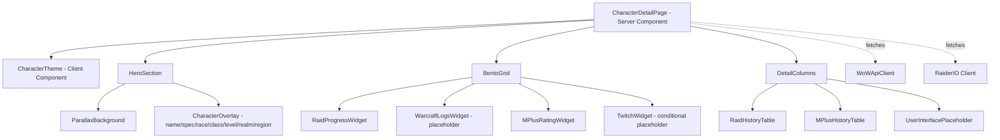

# Design Document: Character Pages Redesign

## Overview

This design transforms the existing character page at `/characters/[realm]/[region]/[characterName]` from a basic profile layout into an immersive character portal. The redesign introduces three major visual changes:

1. A parallax hero section using the character's full-body render ("main-raw" asset) as a background
2. A bento grid of stat widgets overlaying the hero/content boundary
3. A three-column detail section for raid history, M+ history, and a future user-configurable placeholder

The existing data sources (WoW API via `WoWApiClient` and Raider.IO via `getCharacterProfile`) remain unchanged. The existing `CharacterTheme` component continues to apply class-based CSS theming. No new API integrations are required — the WarcraftLogs widget and Twitch widget are placeholders for future iterations.

The tech stack is Next.js 15 (App Router, server components), React 19, Tailwind CSS 3, and TypeScript. Testing uses Vitest with fast-check for property-based tests.

## Architecture

The character page remains a single server component that fetches data via `Promise.allSettled` from both the WoW API and Raider.IO. The page is decomposed into presentational sub-components for each visual section.



All new sub-components are server components (no client-side state needed) except `CharacterTheme` which already exists as a client component. The parallax effect uses pure CSS (`background-attachment: fixed`), avoiding client-side scroll listeners.

### Data Flow

1. `CharacterDetailPage` receives route params `{realm, region, characterName}`
2. Validates params (same logic as current implementation)
3. Fetches in parallel: `getCharacterProfile`, `getCharacterMedia`, `getCharacterProfile` (Raider.IO)
4. Extracts `main-raw` asset from media response for the hero background
5. Passes data slices to each sub-component as props
6. Each sub-component renders independently; missing data triggers fallback UI

## Components and Interfaces

### HeroSection

Located at `app/characters/[realm]/[region]/[characterName]/hero-section.tsx`

```typescript
interface HeroSectionProps {
  mainRawUrl: string | undefined;
  classTheme: string; // e.g. "theme-death-knight"
  name: string;
  specName: string | undefined;
  raceName: string;
  className: string;
  level: number;
  realmName: string;
  region: string;
  classColor: string; // e.g. "text-death-knight"
}
```

- Renders a `div` at `h-[40vh]` with `overflow-hidden` and `relative` positioning
- If `mainRawUrl` is provided: renders an `img` with `object-cover`, `absolute inset-0`, and CSS `background-attachment: fixed` style parallax via a wrapper div
- If `mainRawUrl` is absent: renders a gradient fallback using the class theme's `--primary` CSS variable
- Overlays character info (name, spec, race, class, level, realm, region) at the bottom-left with a dark gradient scrim for readability

### BentoGrid

Located at `app/characters/[realm]/[region]/[characterName]/bento-grid.tsx`

```typescript
interface BentoGridProps {
  raidSummary: string | undefined;
  mplusScore: number;
  highestRun: { dungeon: string; level: number } | undefined;
  hasTwitchIntegration: boolean; // always false for now
}
```

- Positioned with negative top margin (`-mt-16`) to overlap the hero section bottom
- Uses CSS Grid: `grid-cols-1 sm:grid-cols-2 lg:grid-cols-4` (or `lg:grid-cols-3` when Twitch is hidden)
- Each widget is a card with `bg-card/80 backdrop-blur-sm border border-border rounded-lg`
- WarcraftLogs widget shows "Coming Soon" placeholder text
- Twitch widget conditionally rendered based on `hasTwitchIntegration`

### RaidHistoryTable

Located at `app/characters/[realm]/[region]/[characterName]/raid-history-table.tsx`

```typescript
interface RaidHistoryTableProps {
  raidProgression: Record<string, RaidProgressionSummary> | undefined;
}
```

- Renders a table/list of raid tiers with columns: raid name, difficulty breakdown (N/H/M kills), summary
- Each row links to the Raider.IO raid page for that character
- Empty state: "No raid history available."

### MPlusHistoryTable

Located at `app/characters/[realm]/[region]/[characterName]/mplus-history-table.tsx`

```typescript
interface MPlusHistoryTableProps {
  bestRuns: MythicPlusBestRun[];
}
```

- Renders a table/list of M+ runs with columns: dungeon name, key level, time, upgrades, score, date
- Each row links to the run URL from Raider.IO (`run.url`)
- Empty state: "No M+ history available."

### UserInterfacePlaceholder

Located at `app/characters/[realm]/[region]/[characterName]/user-placeholder.tsx`

```typescript
// No props needed
```

- Renders a styled card matching the visual style of adjacent columns
- Displays "Coming Soon" heading and brief description text
- Uses same `card` styling pattern as other sections

### Updated Loading Skeleton

The existing `loading.tsx` will be updated to match the new layout:
- Hero skeleton: `h-[40vh]` animated pulse
- Bento grid skeleton: row of 3-4 cards with negative margin overlap
- Three-column skeleton below

## Data Models

No new data models are introduced. The feature relies entirely on existing types:

### From `lib/wow-api/types.ts`
- `CharacterProfile` — character identity (name, realm, class, race, level, achievements)
- `CharacterMedia` — assets array containing `{key: "main-raw", value: string}` for the full render
- `WoWApiResult<T>` — discriminated union for API responses

### From `lib/raiderio/types.ts`
- `EnrichedCharacterProfile` — extends base profile with gear, raid_progression, mythic_plus data
- `RaidProgressionSummary` — per-raid summary (total_bosses, normal/heroic/mythic kills, summary string)
- `MythicPlusBestRun` — individual run (dungeon, level, time, upgrades, score, url)
- `MythicPlusSeasonScore` — season scores (all, dps, healer, tank)
- `CharacterGear` — item level data

### Derived View Data

The page component derives these values from the raw API data before passing to sub-components:

| Derived Value | Source | Logic |
|---|---|---|
| `mainRawUrl` | `CharacterMedia.assets` | `assets.find(a => a.key === "main-raw")?.value` |
| `raidSummary` | `EnrichedCharacterProfile.raid_progression` | First entry's `.summary` |
| `mplusScore` | `EnrichedCharacterProfile.mythic_plus_scores_by_season` | `[0].scores.all` |
| `highestRun` | `EnrichedCharacterProfile.mythic_plus_best_runs` | Run with max `mythic_level` |
| `classColor` | `CharacterProfile.character_class.name` | Lookup in `CLASS_COLORS` map |
| `classTheme` | `CharacterProfile.character_class.name` | Lookup in `CLASS_THEMES` map |


## Correctness Properties

*A property is a characteristic or behavior that should hold true across all valid executions of a system — essentially, a formal statement about what the system should do. Properties serve as the bridge between human-readable specifications and machine-verifiable correctness guarantees.*

### Property 1: Asset selection with fallback

*For any* `CharacterMedia` assets array, if an asset with key `"main-raw"` exists, the hero section should use its value as the background image URL. If no `"main-raw"` asset exists, the hero section should render a class-themed gradient fallback instead.

**Validates: Requirements 1.2, 1.4**

### Property 2: Hero overlay contains all character identity fields

*For any* valid character profile data (name, spec, race, class, level, realm, region), the hero section overlay should contain all of these values in its rendered output.

**Validates: Requirements 1.5**

### Property 3: Class-to-theme mapping

*For any* valid WoW class name from the set of 13 playable classes, the page should map it to the corresponding `theme-{class}` CSS class and `text-{class}` color class. The mapping should be total — every valid class name produces a valid theme.

**Validates: Requirements 1.6**

### Property 4: Raid widget displays progression summary

*For any* non-empty `raid_progression` record from Raider.IO, the raid progress widget should display the summary string of the current (first) raid tier.

**Validates: Requirements 2.3**

### Property 5: M+ widget displays score and highest key

*For any* set of `mythic_plus_scores_by_season` and `mythic_plus_best_runs` data, the M+ rating widget should display the current season's overall score and the dungeon name and key level of the highest completed run.

**Validates: Requirements 2.5**

### Property 6: Raid history rows contain all fields and link correctly

*For any* raid progression record, each rendered row in the raid history table should contain the raid name and boss kill counts (normal, heroic, mythic), and should link to the corresponding external raid page URL.

**Validates: Requirements 3.2, 3.3**

### Property 7: M+ history rows contain all fields and link correctly

*For any* `MythicPlusBestRun` object, the rendered row in the M+ history table should contain the dungeon name, key level, completion time, keystone upgrades, score, and should link to the run's URL.

**Validates: Requirements 4.2, 4.3**

### Property 8: Graceful degradation on partial API failure

*For any* combination of API response states (profile success required, media and Raider.IO may fail), the page should render without throwing and should display the data that is available while showing inline error indicators for failed sections.

**Validates: Requirements 7.2**

## Error Handling

### API Error Strategy

The page uses `Promise.allSettled` to fetch all three data sources in parallel. This ensures that a failure in one source does not block the others.

| Data Source | Failure Behavior |
|---|---|
| WoW Profile API (404) | Call `notFound()` — renders the existing `not-found.tsx` |
| WoW Profile API (other error) | Render error message with "Back to Characters" link |
| WoW Media API (any error) | Hero section renders gradient fallback (no `mainRawUrl`) |
| Raider.IO API (any error) | Bento grid widgets show "—" or "N/A"; history tables show empty state messages |

### Component-Level Fallbacks

- `HeroSection`: Missing `mainRawUrl` → gradient fallback using class theme color
- `BentoGrid`: Missing raid/M+ data → individual widgets show placeholder dashes
- `RaidHistoryTable`: Empty/undefined `raidProgression` → "No raid history available."
- `MPlusHistoryTable`: Empty `bestRuns` array → "No M+ history available."
- `WarcraftLogsWidget`: Always shows "Coming Soon" (placeholder)
- `TwitchWidget`: Always hidden (integration not yet implemented, `hasTwitchIntegration` is `false`)

### Input Validation

The existing parameter validation logic is preserved:
- Region must be in `{"us", "eu", "kr", "tw"}`
- Realm and character name must match `/^[a-zA-Z0-9\- ]+$/`
- Invalid params → `notFound()`

## Testing Strategy

### Property-Based Testing

Use `fast-check` (already in devDependencies) with Vitest. Each property test runs a minimum of 100 iterations.

| Property | Test Approach | Generator Strategy |
|---|---|---|
| Property 1: Asset selection | Generate random arrays of `{key, value}` assets, some with "main-raw", some without | `fc.array(fc.record({key: fc.constantFrom("avatar","inset","main-raw","other"), value: fc.webUrl()}))` |
| Property 2: Hero identity fields | Generate random character profile objects with varying name/spec/race/class/level/realm/region | `fc.record(...)` with string and integer arbitraries |
| Property 3: Class-to-theme mapping | Generate random class names from the valid set of 13 | `fc.constantFrom(...Object.keys(CLASS_COLORS))` |
| Property 4: Raid widget summary | Generate random `RaidProgressionSummary` objects | `fc.record({summary: fc.string(), total_bosses: fc.nat(), ...})` |
| Property 5: M+ widget score/key | Generate random season scores and best run arrays | Composite arbitrary combining score and run generators |
| Property 6: Raid history rows | Generate random `Record<string, RaidProgressionSummary>` | `fc.dictionary(fc.string(), raidProgressionArb)` |
| Property 7: M+ history rows | Generate random `MythicPlusBestRun` objects | `fc.record(...)` matching the type shape |
| Property 8: Graceful degradation | Generate random combinations of success/failure for each API call | `fc.record({profileOk: fc.boolean(), mediaOk: fc.boolean(), rioOk: fc.boolean()})` with constraint that profileOk is true |

Each test must be tagged with a comment:
```
// Feature: character-pages, Property {N}: {property_text}
```

### Unit Testing

Unit tests complement property tests for specific examples and edge cases:

- Hero section renders gradient fallback when no media assets exist
- Hero section renders with main-raw image when available
- Bento grid renders 3 widgets when Twitch is disabled
- WarcraftLogs widget shows "Coming Soon"
- Raid history table shows "No raid history available." for empty data
- M+ history table shows "No M+ history available." for empty data
- Placeholder column renders "Coming Soon" text
- Loading skeleton matches new layout structure (hero + bento + three columns)
- 404 handling when profile API returns 404
- Parameter validation rejects invalid regions/realms/names

### Test File Locations

- Property tests: `__tests__/property/character-pages-properties.test.tsx`
- Unit tests: `__tests__/unit/character-pages.test.tsx`
