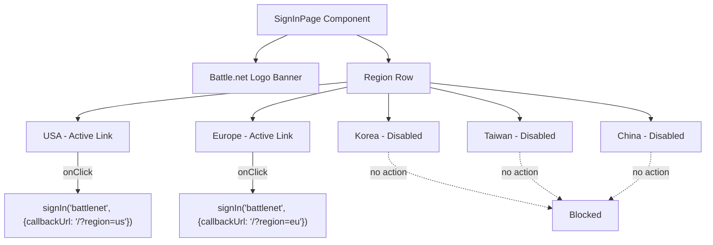

# Design Document: Sign-In Region Links

## Overview

This design transforms the sign-in page from a two-step flow (select region → click sign-in button) into a single-step flow where each region is a direct action link. USA and Europe regions become clickable links that immediately initiate the Battle.net OAuth flow for that region. Korea, Taiwan, and China regions render in a visually disabled state with proper accessibility attributes.

The change is scoped entirely to `app/signin/page.tsx`. No backend, auth config, or provider changes are needed.

## Architecture

The current sign-in page is a client component (`"use client"`) that uses React state to track a selected region and a separate button to trigger `signIn("battlenet", { callbackUrl: ... })`. The redesign eliminates the state management and the separate sign-in button entirely.



### Key Design Decisions

1. **No `useState` needed** — The selected-region state is removed since there's no longer a two-step flow. Each region button is self-contained.
2. **Inline `signIn` calls** — Each active region button calls `signIn` directly in its `onClick` handler, passing the region-specific callback URL.
3. **Disabled via data, not DOM `disabled`** — We use a data-driven approach where the `regions` array includes a `disabled` flag. Disabled regions render as `<span>` elements with `aria-disabled="true"` and muted styling, while active regions render as `<button>` elements.

## Components and Interfaces

### Region Data Model

```typescript
interface Region {
  id: string;       // "us" | "eu" | "kr" | "tw" | "cn"
  label: string;    // Display name: "USA", "Europe", etc.
  disabled: boolean; // true for KR, TW, CN
}

const regions: Region[] = [
  { id: "us", label: "USA", disabled: false },
  { id: "eu", label: "Europe", disabled: false },
  { id: "kr", label: "Korea", disabled: true },
  { id: "tw", label: "Taiwan", disabled: true },
  { id: "cn", label: "China", disabled: true },
];
```

### SignInPage Component (Revised)

The page component renders:
1. The Battle.net logo banner (unchanged)
2. A horizontal row of region elements, each conditionally rendered as active or disabled

Active regions:
- `<button>` element with `onClick` calling `signIn("battlenet", { callbackUrl: "/?region={id}" })`
- Hover/focus styles for interactivity
- `aria-label="Sign in with {label}"` for accessibility

Disabled regions:
- `<span>` element with `role="button"` and `aria-disabled="true"`
- Reduced opacity (`opacity-50`) and `cursor-not-allowed`
- `aria-label="{label} region is unavailable"`
- No click handler

### Helper Function

```typescript
function getRegionCallbackUrl(regionId: string): string {
  return `/?region=${regionId}`;
}
```

This pure function maps a region ID to the OAuth callback URL. It's extracted for testability.

## Data Models

No persistent data model changes. The only data structure is the in-memory `regions` array defined above. The OAuth callback URL pattern (`/?region={id}`) is unchanged from the current implementation.

## Correctness Properties

*A property is a characteristic or behavior that should hold true across all valid executions of a system — essentially, a formal statement about what the system should do. Properties serve as the bridge between human-readable specifications and machine-verifiable correctness guarantees.*

### Property 1: Active region click initiates OAuth with correct region

*For any* active region (US, EU), clicking its element should call `signIn("battlenet", { callbackUrl })` where the `callbackUrl` contains `region={regionId}` for that region.

**Validates: Requirements 2.1, 2.2**

### Property 2: Active regions have accessible sign-in labels

*For any* active region, the rendered element should have an accessible label that contains the region's display name and indicates that clicking will initiate sign-in.

**Validates: Requirements 2.4**

### Property 3: Disabled regions have aria-disabled attribute

*For any* disabled region (KR, TW, CN), the rendered element should have `aria-disabled="true"` set.

**Validates: Requirements 3.1, 3.4**

### Property 4: Disabled region clicks do not trigger OAuth

*For any* disabled region, clicking its element should not invoke `signIn` in any form.

**Validates: Requirements 3.2**

## Error Handling

This feature is a UI-only change with minimal error surface:

1. **signIn failure** — If the `signIn("battlenet", ...)` call throws (e.g., network error), NextAuth handles the error internally and redirects to its error page. No custom error handling is needed in the sign-in page component.
2. **Missing region in callback URL** — The downstream pages already handle the case where `region` is absent from the URL query params, so malformed callback URLs degrade gracefully.
3. **Disabled region click** — Disabled regions use `<span>` elements with no `onClick` handler, making accidental OAuth triggers structurally impossible.

## Testing Strategy

### Unit Tests

Unit tests verify specific examples and edge cases using `@testing-library/react` and `vitest`:

- The blue "Sign in with Battle.net" button is not rendered (Req 1.1)
- Clicking USA calls `signIn("battlenet", { callbackUrl: "/?region=us" })` (Req 2.1)
- Clicking Europe calls `signIn("battlenet", { callbackUrl: "/?region=eu" })` (Req 2.2)
- All five regions are rendered in order: USA, Europe, Korea, Taiwan, China (Req 4.1, 4.2)
- The Battle.net logo image is present (Req 4.3)
- Disabled regions have visually distinct styling (reduced opacity) (Req 3.3)

### Property-Based Tests

Property-based tests use `fast-check` (already in devDependencies) with vitest. Each test runs a minimum of 100 iterations and references its design property.

- **Feature: signin-region-links, Property 1: Active region click initiates OAuth with correct region** — Generate random active regions from {us, eu}, render the page, click the region, assert `signIn` was called with the matching callback URL.
- **Feature: signin-region-links, Property 2: Active regions have accessible sign-in labels** — For each active region, assert the element has an aria-label containing the region name.
- **Feature: signin-region-links, Property 3: Disabled regions have aria-disabled attribute** — Generate random disabled regions from {kr, tw, cn}, render the page, assert `aria-disabled="true"` is present.
- **Feature: signin-region-links, Property 4: Disabled region clicks do not trigger OAuth** — Generate random disabled regions, render the page, click the element, assert `signIn` was never called.

### Testing Library

- **Unit tests**: `vitest` + `@testing-library/react` + `jsdom`
- **Property tests**: `fast-check` (v4.6.0, already installed)
- **Configuration**: Each property test runs minimum 100 iterations via `fc.assert(fc.property(...), { numRuns: 100 })`
- **Tagging**: Each property test includes a comment referencing the design property in the format `Feature: signin-region-links, Property {N}: {title}`
