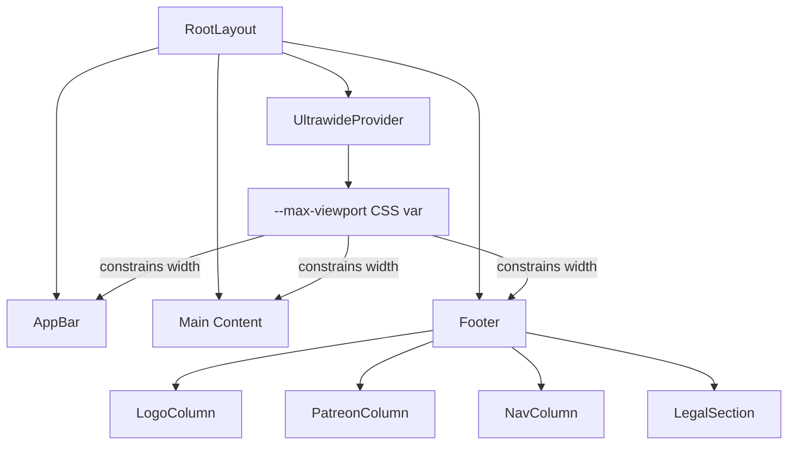

# Design Document: Theme Styling

## Overview

This feature updates the Gamerphile Next.js application in two areas:

1. **Default content width increase**: Change the default `--max-viewport` CSS custom property from `1024px` to `1280px`, with ultrawide mode extending to `1920px` (up from `1280px`).
2. **Footer redesign**: Replace the current minimal footer with a three-column layout (partner logos, Patreon widget, site navigation) plus a legal section with copyright, policy links, and a Blizzard disclaimer.

Both changes are purely presentational and touch the `UltrawideProvider` component, `globals.css`, and the `Footer` component. No new API routes, database changes, or authentication flows are required.

## Architecture

The changes fit within the existing component hierarchy with no new providers or contexts:



### Width Update Flow

1. `globals.css` `:root` sets `--max-viewport: 1280px` (was `1024px`)
2. `UltrawideProvider` toggles the CSS custom property between `1280px` (default) and `1920px` (ultrawide)
3. All layout containers (`AppBar`, `main`, `Footer`) use `max-w-[var(--max-viewport)]` to constrain width

### Footer Structure

The footer is a single `<footer>` element containing:
- A three-column grid (responsive: stacked on mobile, horizontal on `md:` breakpoint at 768px)
- A horizontal divider (`<hr>`)
- A legal section with copyright, policy links, and disclaimer

## Components and Interfaces

### Modified Components

#### `UltrawideProvider` (`components/ultrawide-provider.tsx`)

Current behavior sets `--max-viewport` to `1280px` (ultrawide on) or `1024px` (off).

**Change**: Update the values to `1920px` (ultrawide on) and `1280px` (off).

```typescript
// Before
document.documentElement.style.setProperty(
  "--max-viewport",
  ultrawide ? "1280px" : "1024px"
);

// After
document.documentElement.style.setProperty(
  "--max-viewport",
  ultrawide ? "1920px" : "1280px"
);
```

No interface changes. The `useUltrawide()` hook API remains identical.

#### `Footer` (`components/layout/footer.tsx`)

Complete rewrite. The component will be a server component (no client-side state needed).

**Props**: None (same as current).

**Internal structure**:

```tsx
<footer>
  <div className="mx-auto max-w-[var(--max-viewport)] ...">
    {/* Three-column grid */}
    <div className="grid grid-cols-1 md:grid-cols-3 gap-8">
      {/* Column 1: Partner Logos */}
      <div>
        <a href="https://raider.io" target="_blank" rel="noopener noreferrer">
          
        </a>
        <a href="https://warcraftlogs.com" target="_blank" rel="noopener noreferrer">
          
          <span>WarcraftLogs</span>
        </a>
      </div>

      {/* Column 2: Patreon Widget */}
      <div>
        <p>Support Gamerphile</p>
        <a href="https://patreon.com/gamerphile">Become a Patron</a>
      </div>

      {/* Column 3: Site Navigation */}
      <nav aria-label="Footer navigation">
        <Link href="/">Home</Link>
        <Link href="/news">News</Link>
        <Link href="/characters">Characters</Link>
        <Link href="/ui">UI</Link>
      </nav>
    </div>

    {/* Divider */}
    <hr />

    {/* Legal Section */}
    <div className="text-center">
      <p>© {year} Gamerphile · Privacy Policy · Terms and Conditions</p>
      <p>World of Warcraft® is a registered trademark of Blizzard Entertainment...</p>
    </div>
  </div>
</footer>
```

### CSS Changes

#### `globals.css`

Single change in `:root`:

```css
/* Before */
--max-viewport: 1024px;

/* After */
--max-viewport: 1280px;
```

## Data Models

No new data models are introduced. This feature is entirely presentational. The only "data" involved is:

- **Static strings**: Copyright text, disclaimer text, partner URLs, nav link labels/routes
- **Dynamic value**: `new Date().getFullYear()` for the copyright year
- **CSS custom property**: `--max-viewport` (string value, either `"1280px"` or `"1920px"`)

The nav links mirror the existing `navItems` array used in `AppBar`:

```typescript
const navItems = [
  { href: "/", label: "Home" },
  { href: "/news", label: "News" },
  { href: "/characters", label: "Characters" },
  { href: "/ui", label: "UI" },
];
```


## Correctness Properties

*A property is a characteristic or behavior that should hold true across all valid executions of a system — essentially, a formal statement about what the system should do. Properties serve as the bridge between human-readable specifications and machine-verifiable correctness guarantees.*

### Property 1: UltrawideProvider width mapping

*For any* boolean ultrawide state, the `--max-viewport` CSS custom property must equal `"1280px"` when ultrawide is `false` and `"1920px"` when ultrawide is `true`. There are no other valid states.

**Validates: Requirements 1.1, 1.2, 1.4, 1.5**

### Property 2: Nav link route correctness

*For any* navigation item in the footer's nav column, the rendered link's `href` attribute must exactly match the corresponding route from the core pages list (`/`, `/news`, `/characters`, `/ui`).

**Validates: Requirements 2.8, 2.9**

### Property 3: Footer links have accessible names

*For any* clickable link rendered within the footer, that link must have an accessible name — either through visible text content or an `aria-label` attribute.

**Validates: Requirements 5.4**

### Property 4: External links have security attributes

*For any* link in the footer with `target="_blank"`, that link must also have `rel="noopener noreferrer"`.

**Validates: Requirements 5.5**

## Error Handling

This feature is entirely presentational with no API calls, async operations, or user input processing. Error handling is minimal:

- **Missing logo images**: The `alt` text on `` elements serves as fallback if external logo CDN URLs fail to load. No additional error handling is needed since broken images degrade gracefully with alt text.
- **CSS custom property fallback**: The `:root` default `--max-viewport: 1280px` in `globals.css` ensures the layout works even if the `UltrawideProvider` JavaScript fails to execute (SSR, JS disabled).
- **localStorage unavailable**: The `UltrawideProvider` already wraps `localStorage` access in a `useEffect` (client-only). If localStorage is unavailable, the default state (`false` / `1280px`) applies.

## Testing Strategy

### Unit Tests

Unit tests verify specific rendered output of the footer component:

- Footer renders three column sections (logo, patreon, nav)
- Raider.IO logo link points to `https://raider.io` with `target="_blank"`
- WarcraftLogs logo link points to `https://warcraftlogs.com` with `target="_blank"`
- "WarcraftLogs" text is rendered adjacent to the logo
- Patreon section contains a link to the Gamerphile Patreon page
- Nav column contains links to Home, News, Characters, and UI
- Footer contains a `<nav>` element with `aria-label`
- Legal section contains current year and "Gamerphile"
- Legal section contains "Privacy Policy" and "Terms and Conditions" links
- Legal section contains Blizzard disclaimer text
- A divider separates the columns from the legal section
- Footer container uses `max-w-[var(--max-viewport)]`
- CSS `:root` default for `--max-viewport` is `1280px`

### Property-Based Tests

Property-based tests use `fast-check` (already in devDependencies) with a minimum of 100 iterations per test. Each test references its design document property.

- **Feature: theme-styling, Property 1: UltrawideProvider width mapping** — Generate random boolean values, render the provider, assert the CSS property matches the expected width.
- **Feature: theme-styling, Property 2: Nav link route correctness** — Generate random subsets/orderings of the nav items array, render the footer, assert all expected routes are present with correct hrefs.
- **Feature: theme-styling, Property 3: Footer links have accessible names** — Render the footer, collect all `<a>` elements, assert each has either text content or `aria-label`.
- **Feature: theme-styling, Property 4: External links have security attributes** — Render the footer, collect all `<a target="_blank">` elements, assert each has `rel="noopener noreferrer"`.

Each correctness property is implemented by a single property-based test. Tests are tagged with comments in the format: `Feature: theme-styling, Property {number}: {title}`.
