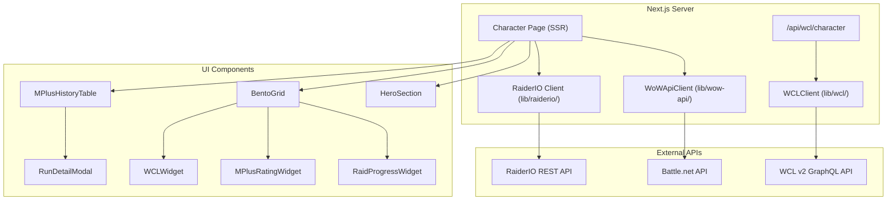

# Design Document: WCL Integration

## Overview

This feature integrates the Warcraft Logs (WCL) v2 GraphQL API into the Gamerphile character page, adds RaiderIO M+ score color coding, enhances the bento grid widgets (Raid Progress, M+ Rating, Warcraft Logs), redesigns the M+ History table with expandable run details, and improves responsive/ultrawide layouts.

The implementation follows the existing patterns established by the `WoWApiClient` (OAuth2 client credentials + typed result unions) and the `RaiderIO_Client` (REST fetch with caching). A new `WCLClient` class in `lib/wcl/` mirrors the `WoWApiClient` pattern: OAuth2 token management, typed responses, and a generic query helper. The RaiderIO client gains a `getScoreTiers()` function and expanded profile fields. UI components are enhanced in-place within the character page directory.

## Architecture



### Key Design Decisions

1. **WCL data fetched client-side via API route**: WCL credentials must not be exposed to the browser. A `/api/wcl/character` route proxies requests. This keeps the character page SSR fast (WCL data loads after initial paint).
2. **Score color resolution as a pure utility function**: `resolveScoreColor(score, tiers)` is a standalone pure function in `lib/raiderio/score-colors.ts`, making it trivially testable and reusable.
3. **WCLClient mirrors WoWApiClient pattern**: Same OAuth2 client-credentials flow, same token caching with expiry check, same error handling shape. Developers familiar with one client immediately understand the other.
4. **Expandable UI via Radix primitives**: The project already uses `@radix-ui/react-tabs` and `@radix-ui/react-dialog`. The Raid Progress difficulty tabs, M+ Rating spec tabs, and Run Detail Modal all use these existing dependencies.

## Components and Interfaces

### New Files

| File | Purpose |
|------|---------|
| `lib/wcl/client.ts` | WCLClient class: OAuth2 auth, GraphQL query execution, character data queries |
| `lib/wcl/types.ts` | WCL response type definitions (WCLCharacter, WCLEncounterRanking, WCLZoneRanking, WCLReport) |
| `lib/raiderio/score-colors.ts` | `resolveScoreColor()` pure function and `getScoreTiers()` fetch function |
| `app/api/wcl/character/route.ts` | Next.js API route proxying WCL character data requests |
| `app/[region]/[realm]/[characterName]/run-detail-modal.tsx` | RunDetailModal dialog component |

### Modified Files

| File | Changes |
|------|---------|
| `lib/raiderio/types.ts` | Add `ScoreTier`, `MythicPlusRanks`, `MythicPlusSpecScore` interfaces; expand `EnrichedCharacterProfile` |
| `lib/raiderio/client.ts` | Add `getScoreTiers()` function; update `getCharacterProfile` fields string |
| `app/[region]/[realm]/[characterName]/page.tsx` | Fetch score tiers, pass new props to widgets, add WCL client-side fetch |
| `app/[region]/[realm]/[characterName]/bento-grid.tsx` | Enhance RaidProgressWidget, MPlusRatingWidget, WCLWidget with new data/UI |
| `app/[region]/[realm]/[characterName]/mplus-history-table.tsx` | Redesign with expandable rows and player detail links |
| `app/[region]/[realm]/[characterName]/hero-section.tsx` | Add mobile responsive styles (50vh on <768px) |

### Component Interfaces

```typescript
// WCLClient
class WCLClient {
  constructor();  // reads WCL_CLIENT_ID, WCL_CLIENT_SECRET from env
  query<T>(query: string, variables?: Record<string, unknown>): Promise<T>;
  getCharacterZoneRankings(name: string, serverSlug: string, serverRegion: string, zoneID?: number, difficulty?: number): Promise<WCLZoneRanking | null>;
  getCharacterEncounterRankings(name: string, serverSlug: string, serverRegion: string, zoneID?: number, difficulty?: number): Promise<WCLEncounterRanking[] | null>;
}

// Score color resolution
function resolveScoreColor(score: number, tiers: ScoreTier[]): string;

// Enhanced widget props
interface RaidProgressWidgetProps {
  raidSummary: string | undefined;
  raidProgression: Record<string, RaidProgressionSummary> | undefined;
  regionRank: number | undefined;
  worldRank: number | undefined;
}

interface MPlusRatingWidgetProps {
  mplusScore: number;
  highestRun: { dungeon: string; level: number } | undefined;
  scoreColor: string;
  ranks: MythicPlusRanks | undefined;
  specScores: MythicPlusSpecScore[] | undefined;
  scoreTiers: ScoreTier[];
}

interface WCLWidgetProps {
  characterName: string;
  serverSlug: string;
  serverRegion: string;
}
```

## Data Models

### WCL Types (`lib/wcl/types.ts`)

```typescript
export interface WCLCharacter {
  name: string;
  serverSlug: string;
  serverRegion: string;
  classID: number;
}

export interface WCLEncounterRanking {
  encounterName: string;
  encounterID: number;
  percentile: number;       // 0–100 Parse_Percentile
  spec: string;
  difficulty: number;
  reportCode: string;
}

export interface WCLZoneRanking {
  zoneName: string;
  zoneID: number;
  bestPercentile: number;   // 0–100
  medianPercentile: number; // 0–100
  difficulty: number;
}

export interface WCLReport {
  code: string;
  title: string;
  startTime: number;
  endTime: number;
  zoneID: number;
}

export interface WCLCharacterResponse {
  zoneRankings: WCLZoneRanking | null;
  encounterRankings: WCLEncounterRanking[] | null;
}
```

### RaiderIO Extended Types (additions to `lib/raiderio/types.ts`)

```typescript
export interface ScoreTier {
  score: number;
  rgbHex: string;
}

export interface MythicPlusRanks {
  overall: { world: number; region: number; realm: number };
  specs: Record<string, { world: number; region: number; realm: number }>;
}

export interface MythicPlusSpecScore {
  spec: string;
  score: number;
  ranks: { world: number; region: number; realm: number };
}
```

### WCL Parse Percentile Color Scheme

| Range | Color | Hex |
|-------|-------|-----|
| 0–24 | Grey | `#666666` |
| 25–49 | Green | `#1eff00` |
| 50–74 | Blue | `#0070ff` |
| 75–94 | Purple | `#a335ee` |
| 95–98 | Orange | `#ff8000` |
| 99 | Pink | `#e268a8` |
| 100 | Gold | `#e5cc80` |

```typescript
export function resolveParseColor(percentile: number): string {
  if (percentile >= 100) return "#e5cc80";
  if (percentile >= 99) return "#e268a8";
  if (percentile >= 95) return "#ff8000";
  if (percentile >= 75) return "#a335ee";
  if (percentile >= 50) return "#0070ff";
  if (percentile >= 25) return "#1eff00";
  return "#666666";
}
```

